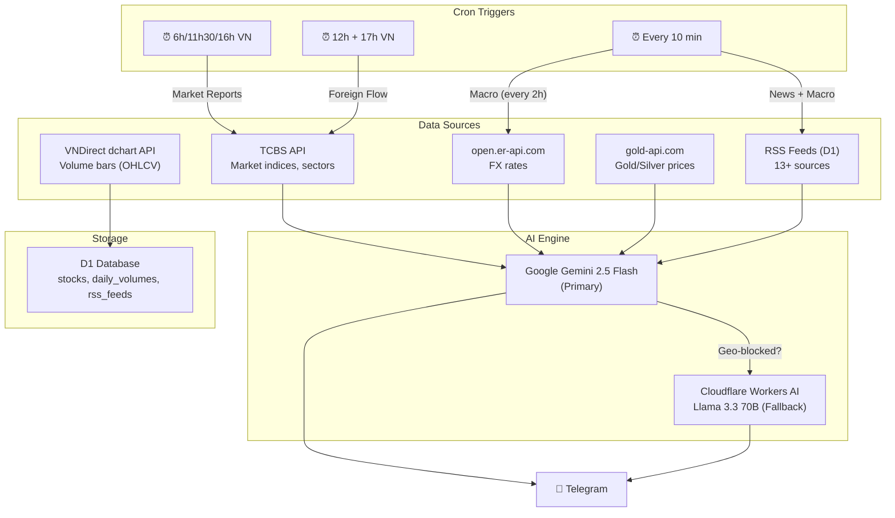

# VN Stock Telegram Bot — Documentation

> **URL**: `https://vn-stock-telegram-bot.duane-le.workers.dev`
> **Platform**: Cloudflare Workers (TypeScript) + D1 Database
> **Delivery**: Telegram Group Chat

---

## Architecture



---

## 📡 API Endpoints

### Reports (Manual Triggers)

| Method | Path | Description |
|--------|------|-------------|
| `GET` | `/trigger?type=morning` | Market briefing (morning/midday/afternoon) |
| `GET` | `/news` | News digest |
| `GET` | `/macro` | Macro indicators report |
| `GET` | `/foreign` | Foreign investor flow report |

### Volume Tracking

| Method | Path | Description |
|--------|------|-------------|
| `GET` | `/snapshot` | Snapshot today's volume for 121 stocks → D1 |
| `GET` | `/spikes` | Get volume spike list (JSON) |

### RSS Feed Management

| Method | Path | Description |
|--------|------|-------------|
| `GET` | `/feeds` | List all RSS feeds |
| `POST` | `/feeds` | Add new feed `{url, source, category}` |
| `DELETE` | `/feeds?id=N` | Delete a feed by id |

### System

| Method | Path | Description |
|--------|------|-------------|
| `GET` | `/` or `/health` | Health check + schedule info |

---

## ⏰ Cron Schedules

| Cron (UTC) | VN Time | Type |
|------------|---------|------|
| `0 23 * * 1,2,3,4,5` | 6:00 AM Mon-Fri | 📈 Morning briefing (+ volume spike alerts) |
| `30 4 * * 2,3,4,5,6` | 11:30 AM Mon-Fri | 📈 Midday briefing |
| `0 9 * * 2,3,4,5,6` | 4:00 PM Mon-Fri | 📈 Afternoon briefing (+ volume snapshot) |
| `*/10 * * * *` | Every 10 min 24/7 | 📰 News digest |
| ↳ *(code check)* | Every 2h (8-22h VN) | 📊 Macro report (piggybacks on news cron) |
| `0 5,10 * * 2,3,4,5,6` | 12:00 + 17:00 Mon-Fri | 💰 Foreign flow |

---

## 📈 Report Types

### 1. Market Briefing (`/trigger`)
- **Data**: VN-Index, HNX, UPCOM, watchlist (10 CP), top gainers/losers, sector performance
- **Source**: TCBS API
- **AI Prompt**: Vietnamese analysis with trading strategy suggestions
- **Morning only**: Includes 🚨 volume spike alerts from D1

### 2. News Digest (`/news`)
- **Data**: 13+ RSS feeds from D1 (CafeF, VnExpress, Tuổi Trẻ, Dân Trí, Lao Động, etc.)
- **AI Prompt**: Summarize 10-15 news items with source links
- **Format**: HTML with emoji, clickable `<a href>` sources

### 3. Macro Report (`/macro`)
- **Data**:
  - 💱 FX: USD/VND, EUR/VND, USD/JPY, DXY (from `open.er-api.com`)
  - 🥇 Gold XAU + Silver XAG (from `gold-api.com`)
  - 📰 News context (for AI to synthesize oil, Fed rates, BĐS)
- **AI Prompt**: Macro analysis covering FX, commodities, rates, real estate, investment outlook

### 4. Foreign Flow (`/foreign`)
- **Data**: Top 10 foreign buy/sell stocks from TCBS screening API
- **AI Prompt**: Foreign investor analysis, fund tracking, sector accumulation trends

---

## 🗄️ D1 Database Schema

**Database**: `vn-stock-db` (APAC/HKG region)

### Tables

````carousel
```sql
-- Stock master list (121 stocks: HOSE + HNX + UPCOM)
CREATE TABLE stocks (
  symbol TEXT PRIMARY KEY,
  sector TEXT NOT NULL,  -- e.g. 'Ngân hàng', 'Bất động sản'
  name TEXT
);
```
<!-- slide -->
```sql
-- Daily volume snapshots (auto-cleaned: 60 days)
CREATE TABLE daily_volumes (
  symbol TEXT NOT NULL,
  date TEXT NOT NULL,       -- YYYY-MM-DD
  close_price REAL,
  volume INTEGER,
  PRIMARY KEY (symbol, date)
);
```
<!-- slide -->
```sql
-- RSS feed sources (managed via /feeds API)
CREATE TABLE rss_feeds (
  id INTEGER PRIMARY KEY AUTOINCREMENT,
  url TEXT UNIQUE NOT NULL,
  source TEXT NOT NULL,     -- e.g. 'CafeF', 'VnExpress'
  category TEXT NOT NULL,   -- e.g. '📈 Chứng khoán'
  enabled INTEGER DEFAULT 1,
  created_at TEXT DEFAULT (datetime('now'))
);
```
````

### Stock Sectors (15+)

| Sector | Count | Examples |
|--------|-------|---------|
| Ngân hàng | 16 | VCB, TCB, MBB, ACB, SHB |
| Bất động sản | 12 | VHM, VIC, NVL, KDH, DXG |
| Chứng khoán | 8 | SSI, VND, HCM, VCI |
| Thép | 5 | HPG, HSG, NKG |
| Công nghệ | 3 | FPT, CMG, CTR |
| Dầu khí | 5+ | GAS, PLX, PVD, PVS, BSR |
| Thực phẩm | 5 | VNM, MSN, SAB, QNS |
| Bán lẻ | 4 | MWG, FRT, PNJ, DGW |
| + 7 more sectors | ... | Xây dựng, Hóa chất, Logistics, etc. |

---

## 🔧 Data Sources

| Source | API | Used For | Auth |
|--------|-----|----------|------|
| **VNDirect dchart** | `dchart-api.vndirect.com.vn/dchart/history` | Volume OHLCV bars | Free, no key |
| **TCBS** | `apipubaws.tcbs.com.vn` | Market indices, sectors, foreign flow | Free, no key |
| **open.er-api.com** | `open.er-api.com/v6/latest/USD` | FX rates | Free, 1500 req/mo |
| **gold-api.com** | `api.gold-api.com/price/XAU` | Gold/Silver prices | Free |
| **Google Gemini** | `generativelanguage.googleapis.com` | AI analysis (primary) | API key |
| **Workers AI** | Native CF binding | AI fallback (Llama 3.3 70B) | Built-in |

---

## 🔐 Environment

### Secrets (via `wrangler secret put`)
| Key | Description |
|-----|-------------|
| `TELEGRAM_BOT_TOKEN` | Telegram Bot API token |
| `GEMINI_API_KEY` | Google Gemini API key |

### Vars (in `wrangler.toml`)
| Key | Value |
|-----|-------|
| `TELEGRAM_CHAT_ID` | `-5175947373` |
| `WATCHLIST` | `VCB,FPT,HPG,VNM,VHM,TCB,MWG,VPB,MBB,ACB` |

---

## 📁 Project Structure

```
worker/
├── wrangler.toml          # CF config, crons, D1 binding
├── schema.sql             # D1 migration (stocks + volumes)
├── src/
│   ├── index.ts           # Entry: cron handler + HTTP routes
│   ├── gemini.ts          # AI: 4 report generators + prompts
│   ├── stock-data.ts      # TCBS: indices, watchlist, sectors, foreign flow
│   ├── macro-data.ts      # FX rates + gold/silver prices
│   ├── volume-tracker.ts  # VNDirect: snapshot + spike detection
│   ├── news.ts            # RSS fetcher (D1-backed)
│   ├── telegram.ts        # Telegram Bot API sender
│   └── types.ts           # TypeScript interfaces
```

---

## 📋 Usage Examples

### Add a new RSS feed
```bash
curl -X POST https://vn-stock-telegram-bot.duane-le.workers.dev/feeds \
  -H "Content-Type: application/json" \
  -d '{"url":"https://cafef.vn/rss/goc-nhin-chuyen-gia.rss","source":"CafeF","category":"💡 Chuyên gia"}'
```

### Trigger volume snapshot manually
```bash
curl https://vn-stock-telegram-bot.duane-le.workers.dev/snapshot
# ✅ Volume snapshot: 50 stocks saved!
```

### Check volume spikes
```bash
curl https://vn-stock-telegram-bot.duane-le.workers.dev/spikes
# Returns JSON array of stocks where 5-day avg volume > 150% of 30-day avg
```

### Deploy after changes
```bash
cd worker && npm run deploy
```

---

## Volume Spike Detection Formula

```
spike_ratio = AVG(volume, last 5 days) / AVG(volume, last 30 days)

IF spike_ratio > 1.5 → 🚨 Volume Alert
```

- Requires ≥3 data points for 5-day avg, ≥10 for 30-day avg
- Alerts auto-included in morning market briefing
- Query via `/spikes` endpoint for raw JSON data
